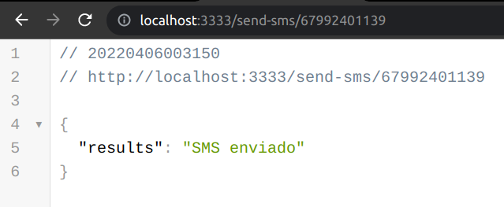
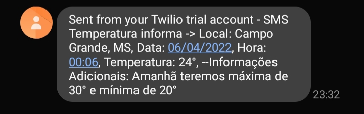

# SMS Temperatura

* Backend consome API Weater (Nos traz informações em tempo real sobre temperatura nas cidades Brasileiras) envia para uma Function onde realiza a chamada de uma API da Twilio realizando o envio de SMS para o celular desejado. 

<div float="left" align="center">
    
    
</div>

### **Iniciar o servidor**
```
yarn dev
```

### **Para realizar o envio da SMS realize a request no Navegador**
```
Phone = 67XXXXXXXXX
http://localhost:3333/send-sms/phone
```

<p>API Weater: https://console.hgbrasil.com/users/sign_in</p>
<p>API Send SMS: https://www.twilio.com/console/projects/summary</p>
